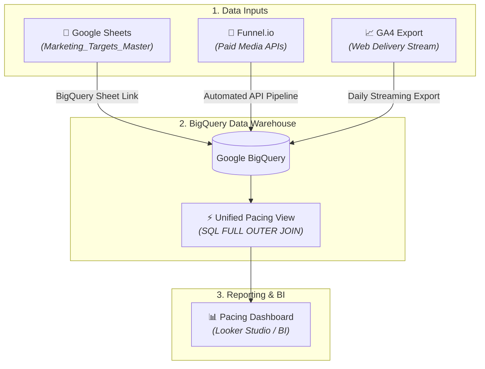

# 🚀 Automated Marketing Pacing & Performance Pipeline

An enterprise-grade data warehouse architecture built on **Google BigQuery** and **Looker Studio**. This system automatically ingests cross-channel ad spend, web analytics delivery, and human-defined targets to deliver real-time budget and conversion run-rate pacing alerts.

---

## 🏗️ Architecture Overview



## 📊 Data Requirements & Schema

The system unifies three distinct data requirements into a single analytical view.

### 1. Paid Media Delivery Schema (e.g., via Funnel.io)
Tracks platform-level performance (Google Ads, Meta, TikTok, etc.) at a daily level.

| Field Name | Type | Description |
| :--- | :--- | :--- |
| `Date` | `DATE` | Event date (`YYYY-MM-DD`) |
| `Channel` | `STRING` | Paid channel identifier (e.g., `Paid Search`, `Paid Social`) |
| `Campaign` | `STRING` | Campaign identifier (e.g., `Branded`, `BFCM-2026`) |
| `Cost` | `NUMERIC` | Gross spend amount (£) |
| `Impressions` | `INTEGER` | Total ad impressions |
| `Clicks` | `INTEGER` | Total ad clicks |

### 2. Google Analytics Delivery Schema (via GA4 Export)
Tracks site-level sessions and conversion activity for **all traffic sources** (Paid & Organic).

| Field Name | Type | Description |
| :--- | :--- | :--- |
| `Date` | `DATE` | Event date (`YYYY-MM-DD`) |
| `Channel` | `STRING` | Channel grouping (`Paid Search`, `Paid Social`, `Organic`, `Email`) |
| `Sessions` | `INTEGER` | Total site visits |
| `GA Transactions`| `INTEGER` | Completed conversions/orders |
| `GA Revenue` | `NUMERIC` | Total attributed revenue (£) |

### 3. Key Business Metrics Delivery Schema
Tracking key business metrics 

| Field Name | Type | Description |
| :--- | :--- | :--- |
| `Date` | `DATE` | Event date (`YYYY-MM-DD`) |
| `Shopify Orders` | `INTEGER` | Total orders coming from shopify |
| `Shopify Revenue` | `NUMERIC` | Total revenue (£) coming from shopify |
| `Total_Customers_Target` | `INTEGER` | Total Customer volume |
| `New_Customers_Target` | `INTEGER` | New Customer volume |
| `Profit Target` | `NUMERIC` | Profit (£) |

### 4. Channel Targets Schema (Google Sheets Input)
Human-managed target benchmarks maintained in Google Sheets (`Marketing_Targets_Master`).

| Field Name | Type | Description |
| :--- | :--- | :--- |
| `Month` | `DATE` | Target month start date (`YYYY-MM-01`) |
| `Channel` | `STRING` | Marketing channel |
| `Campaign` | `STRING` | Campaign identifier (e.g., `Branded`, `BFCM-2026`) |
| `Spend Target` | `NUMERIC` | Allocated monthly budget (£) |
| `Conversions Target` | `INTEGER` | Target conversion volume |
| `Target CPA` | `NUMERIC` | Benchmark cost-per-acquisition (£) |
| `Revenue Target` | `NUMERIC` | Target Revenue (£) |
| `Notes` | `STRING` | Strategic context (e.g., `Spring Campaign Push`) |

### 5. All Targets Schema (Google Sheets Input)
Human-managed target benchmarks maintained in Google Sheets (`Marketing_Targets_Master`).

| Field Name | Type | Description |
| :--- | :--- | :--- |
| `Month` | `DATE` | Target month start date (`YYYY-MM-01`) |
| `Spend Target` | `NUMERIC` | Allocated monthly budget (£) |
| `Conversions Target` | `INTEGER` | Target conversion volume |
| `Revenue Target` | `NUMERIC` | Target Revenue (£) |
| `Total_Customers_Target` | `INTEGER` | Total Custoemr Target volume |
| `New_Customers_Target` | `INTEGER` | New Custoemr Target volume |
| `Profit Target` | `NUMERIC` | Target Profit (£) |

---

# Master Data Dictionary & Field Mapping Reference

This reference maps all 5 raw Google Sheets tabs to raw BigQuery schema fields and defines the standardized calculation logic for downstream SQL modeling and Looker Studio reporting.

---

## 📑 1. Raw Layer (`raw_`) — Google Sheets to BigQuery Tables

| Source Sheet Tab | Google Sheet Header | BigQuery Field Name | Data Type | Notes / Clean Transformations |
| :--- | :--- | :--- | :--- | :--- |
| **`PaidMedia`** | Date | `Date` | `DATE` | Link Range: `PaidMedia!A1:F` |
| | Channel | `Channel` | `STRING` | Standardized channel string |
| | Campaign | `Campaign` | `STRING` | Campaign name grouping |
| | Cost | `Cost` | `NUMERIC` | Raw ad spend |
| | Impressions | `Impressions` | `INTEGER` | Total ad impressions |
| | Clicks | `Clicks` | `INTEGER` | Total ad clicks |
| **`GoogleAnalytics`** | Date | `Date` | `DATE` | Link Range: `GoogleAnalytics!A1:E` |
| | Channel | `Channel` | `STRING` | Web traffic source grouping |
| | Sessions | `Sessions` | `INTEGER` | GA4 session counts |
| | GA Transactions | `GA_Transactions` | `INTEGER` | Web order conversions |
| | GA Revenue | `GA_Revenue` | `NUMERIC` | E-commerce revenue |
| **`Shopify`** | Date | `Date` | `DATE` | Link Range: `Shopify!A1:F` |
| | Shopify_Orders | `Shopify_Orders` | `INTEGER` | Order count from ERP/Store |
| | Shopify_Revenue | `Shopify_Revenue` | `NUMERIC` | Gross shop revenue |
| | Total_Customers | `Total_Customers` | `INTEGER` | Total active buying customers |
| | New_Customers | `New_Customers` | `INTEGER` | First-time buyers |
| | **Profit** | **`Profit`** | **`NUMERIC`** | **Net/Gross Profit (£)** |
| **`ChannelsTargets`** | Month | `Month` | `DATE` | Link Range: `ChannelsTargets!A1:H` |
| | Channel | `Channel` | `STRING` | Target channel |
| | Campaign | `Campaign` | `STRING` | Target campaign |
| | Spend Target | `Spend_Target` | `NUMERIC` | Planned channel spend |
| | Conversions Target | `Conversions_Target` | `INTEGER` | Target channel conversions |
| | Target CPA | `Target_CPA` | `NUMERIC` | Target CPA benchmark |
| | Revenue Target | `Revenue_Target` | `NUMERIC` | Target channel revenue |
| | Notes | `Notes` | `STRING` | Context notes |
| **`AllTargets`** | Month | `Month` | `DATE` | Link Range: `AllTargets!A1:G` |
| | Spend Target | `Spend_Target` | `NUMERIC` | Total store spend target |
| | Conversions Target | `Conversions_Target` | `INTEGER` | Total store order target |
| | Revenue Target | `Revenue_Target` | `NUMERIC` | Total store revenue target |
| | Total_Customers_Target | `Total_Customers_Target` | `INTEGER` | Total buyer target |
| | New_Customers_Target | `New_Customers_Target` | `INTEGER` | New buyer target |
| | **Profit_Target** | **`Profit_Target`** | **`NUMERIC`** | **Store Gross Profit Target** |

---

## 🧮 2. Staging & Master Layer Metrics (`stg_` / `rpt_`)

### Core Blended Metrics

* **POAS (Profit on Ad Spend):** `Shopify Profit / Paid Media Cost`
* **ROAS (Return on Ad Spend):** `Shopify Revenue / Paid Media Cost`
* **Gross Profit Margin %:** `Shopify Profit / Shopify Revenue`
* **Blended CPA:** `Paid Media Cost / Shopify Orders`
* **Blended CAC (New Customers):** `Paid Media Cost / New Customers`

---

### Profit & Pacing SQL Logic

```sql
-- Daily Target Run-Rate (Overall Profit Target / Days in Month)
COALESCE(t.Profit_Target, 0) / EXTRACT(DAY FROM LAST_DAY(r.date)) AS daily_profit_target,

-- Month-to-Date Profit Delivery %
SAFE_DIVIDE(SUM(s.Profit), MAX(t.Profit_Target)) AS pct_profit_target_delivered,

-- Projected Month-End Profit Variance (£)
((SAFE_DIVIDE(SUM(s.Profit), EXTRACT(DAY FROM CURRENT_DATE())) * EXTRACT(DAY FROM LAST_DAY(CURRENT_DATE()))) - MAX(t.Profit_Target)) AS projected_profit_variance

