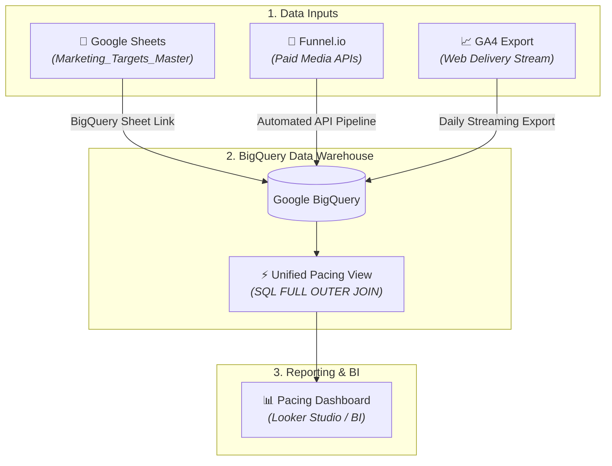

# 🚀 Automated Marketing Pacing & Performance Pipeline

An enterprise-grade data warehouse architecture built on **Google BigQuery** and **Looker Studio**. This system automatically ingests cross-channel ad spend, web analytics delivery, and human-defined targets to deliver real-time budget and conversion run-rate pacing alerts.

---

## 🏗️ Architecture Overview



## 📊 Data Requirements & Schema

The system unifies three distinct data requirements into a single analytical view

### 1. Paid Media Delivery Schema (e.g., via Funnel.io)
Tracks platform-level performance (Google Ads, Meta, TikTok, etc.) at a daily level

| Field Name | Type | Description |
| :--- | :--- | :--- |
| `Date` | `DATE` | Event date (`YYYY-MM-DD`) |
| `Channel` | `STRING` | Paid channel identifier (e.g., `Paid Search`, `Paid Social`) |
| `Campaign` | `STRING` | Campaign identifier (e.g., `Branded`, `BFCM-2026`) |
| `Cost` | `NUMERIC` | Gross spend amount (£) |
| `Impressions` | `INTEGER` | Total ad impressions |
| `Clicks` | `INTEGER` | Total ad clicks |

### 2. Google Analytics Delivery Schema (via GA4 Export)
Tracks site-level sessions and conversion activity for **all traffic sources** (Paid & Organic) 

There will need to be 2 views created a daily and a monthly view. 

| Field Name | Type | Description |
| :--- | :--- | :--- |
| `Date` | `DATE` | Event date (`YYYY-MM-DD`) |
| `Channel` | `STRING` | Channel grouping (`Paid Search`, `Paid Social`, `Organic`, `Email`) |
| `Sessions` | `INTEGER` | Total site visits |
| `GA Transactions`| `INTEGER` | Completed conversions/orders |
| `GA Revenue` | `NUMERIC` | Total attributed revenue (£) |

### 3. Key Business Metrics Delivery Schema
Tracking key business metrics 

There will need to be 2 views created a daily and a monthly view. 

| Field Name | Type | Description |
| :--- | :--- | :--- |
| `Date` | `DATE` | Event date (`YYYY-MM-DD`) |
| `Shopify Orders` | `INTEGER` | Total orders coming from shopify |
| `Shopify Revenue` | `NUMERIC` | Total revenue (£) coming from shopify |
| `Total_Customers_Target` | `INTEGER` | Total Customer volume |
| `New_Customers_Target` | `INTEGER` | New Customer volume |
| `Profit Target` | `NUMERIC` | Profit (£) |

### 4. Channel Targets Schema (Google Sheets Input)
Human-managed target benchmarks maintained in Google Sheets (`Marketing_Targets_Master`)

| Field Name | Type | Description |
| :--- | :--- | :--- |
| `Month` | `DATE` | Target month start date (`YYYY-MM-01`) |
| `Channel` | `STRING` | Marketing channel |
| `Campaign` | `STRING` | Campaign identifier (e.g., `Branded`, `BFCM-2026`) |
| `Spend Target` | `NUMERIC` | Allocated monthly budget (£) |
| `Conversions Target` | `INTEGER` | Target conversion volume |
| `Target CPA` | `NUMERIC` | Benchmark cost-per-acquisition (£) |
| `Revenue Target` | `NUMERIC` | Target Revenue (£) |
| `Notes` | `STRING` | Strategic context (e.g., `Spring Campaign Push`) |

### 5. All Targets Schema (Google Sheets Input)
Human-managed target benchmarks maintained in Google Sheets (`Marketing_Targets_Master`)

| Field Name | Type | Description |
| :--- | :--- | :--- |
| `Month` | `DATE` | Target month start date (`YYYY-MM-01`) |
| `Spend Target` | `NUMERIC` | Allocated monthly budget (£) |
| `Conversions Target` | `INTEGER` | Target conversion volume |
| `Revenue Target` | `NUMERIC` | Target Revenue (£) |
| `Total_Customers_Target` | `INTEGER` | Total Custoemr Target volume |
| `New_Customers_Target` | `INTEGER` | New Custoemr Target volume |
| `Profit Target` | `NUMERIC` | Target Profit (£) |

---

# Master Data Dictionary & Field Mapping Reference

This reference maps all 5 raw Google Sheets tabs to raw BigQuery schema fields and defines the standardized calculation logic for downstream SQL modeling and Looker Studio reporting.

---

## 📑 1. Raw Layer (`raw_`) — Google Sheets to BigQuery Tables

| Source Sheet Tab | Google Sheet Header | BigQuery Field Name | Data Type | Notes / Clean Transformations |
| :--- | :--- | :--- | :--- | :--- |
| **`PaidMedia`** | Date | `Date` | `DATE` | Link Range: `PaidMedia!A1:F` |
| | Channel | `Channel` | `STRING` | Standardized channel string |
| | Campaign | `Campaign` | `STRING` | Campaign name grouping |
| | Cost | `Cost` | `NUMERIC` | Raw ad spend |
| | Impressions | `Impressions` | `INTEGER` | Total ad impressions |
| | Clicks | `Clicks` | `INTEGER` | Total ad clicks |
| **`GoogleAnalytics`** | Date | `Date` | `DATE` | Link Range: `GoogleAnalytics!A1:E` |
| | Channel | `Channel` | `STRING` | Web traffic source grouping |
| | Sessions | `Sessions` | `INTEGER` | GA4 session counts |
| | GA Transactions | `GA_Transactions` | `INTEGER` | Web order conversions |
| | GA Revenue | `GA_Revenue` | `NUMERIC` | E-commerce revenue |
| **`Shopify`** | Date | `Date` | `DATE` | Link Range: `Shopify!A1:F` |
| | Shopify_Orders | `Shopify_Orders` | `INTEGER` | Order count from ERP/Store |
| | Shopify_Revenue | `Shopify_Revenue` | `NUMERIC` | Gross shop revenue |
| | Total_Customers | `Total_Customers` | `INTEGER` | Total active buying customers |
| | New_Customers | `New_Customers` | `INTEGER` | First-time buyers |
| | **Profit** | **`Profit`** | **`NUMERIC`** | **Net/Gross Profit (£)** |
| **`ChannelsTargets`** | Month | `Month` | `DATE` | Link Range: `ChannelsTargets!A1:H` |
| | Channel | `Channel` | `STRING` | Target channel |
| | Campaign | `Campaign` | `STRING` | Target campaign |
| | Spend Target | `Spend_Target` | `NUMERIC` | Planned channel spend |
| | Conversions Target | `Conversions_Target` | `INTEGER` | Target channel conversions |
| | Target CPA | `Target_CPA` | `NUMERIC` | Target CPA benchmark |
| | Revenue Target | `Revenue_Target` | `NUMERIC` | Target channel revenue |
| | Notes | `Notes` | `STRING` | Context notes |
| **`AllTargets`** | Month | `Month` | `DATE` | Link Range: `AllTargets!A1:G` |
| | Spend Target | `Spend_Target` | `NUMERIC` | Total store spend target |
| | Conversions Target | `Conversions_Target` | `INTEGER` | Total store order target |
| | Revenue Target | `Revenue_Target` | `NUMERIC` | Total store revenue target |
| | Total_Customers_Target | `Total_Customers_Target` | `INTEGER` | Total buyer target |
| | New_Customers_Target | `New_Customers_Target` | `INTEGER` | New buyer target |
| | **Profit_Target** | **`Profit_Target`** | **`NUMERIC`** | **Store Gross Profit Target** |

---

## 🧮 2. Staging & Master Layer Metrics (`stg_` / `rpt_`)

### Core Blended Metrics

* **POAS (Profit on Ad Spend):** `Shopify Profit / Paid Media Cost`
* **ROAS (Return on Ad Spend):** `Shopify Revenue / Paid Media Cost`
* **Gross Profit Margin %:** `Shopify Profit / Shopify Revenue`
* **Blended CPA:** `Paid Media Cost / Shopify Orders`
* **Blended CAC (New Customers):** `Paid Media Cost / New Customers`

---

### Profit & Pacing SQL Logic

```sql
-- Daily Target Run-Rate (Overall Profit Target / Days in Month)
COALESCE(t.Profit_Target, 0) / EXTRACT(DAY FROM LAST_DAY(r.date)) AS daily_profit_target,

-- Month-to-Date Profit Delivery %
SAFE_DIVIDE(SUM(s.Profit), MAX(t.Profit_Target)) AS pct_profit_target_delivered,

-- Projected Month-End Profit Variance (£)
((SAFE_DIVIDE(SUM(s.Profit), EXTRACT(DAY FROM CURRENT_DATE())) * EXTRACT(DAY FROM LAST_DAY(CURRENT_DATE()))) - MAX(t.Profit_Target)) AS projected_profit_variance

# Looker Studio Calculated Fields Documentation

This repository contains the calculated field specifications for the BigQuery-backed Looker Studio E-Commerce & Forecasting Dashboard.

---

## Data Source 1: `rpt_daily_performance`
*Primary dataset for executive summary, overall store health, profitability, customer acquisition, and storewide target pacing.*

### A. Profitability & Unit Economics

| Field Name | Formula | Type | Description |
| :--- | :--- | :--- | :--- |
| **POAS (Profit on Ad Spend)** | `SUM(shopify_profit) / SUM(ad_spend)` | Decimal / % | Ratio of total gross profit to ad spend |
| **Blended ROAS** | `SUM(shopify_revenue) / SUM(ad_spend)` | Decimal | Return on ad spend across all revenue |
| **Gross Profit Margin %** | `SUM(shopify_profit) / SUM(shopify_revenue)` | Percent | Proportion of net revenue that is gross profit |
| **Blended CPA** | `SUM(ad_spend) / SUM(shopify_orders)` | Currency (£) | Cost per completed order across all channels |
| **Blended CAC** | `SUM(ad_spend) / SUM(new_customers)` | Currency (£) | Cost to acquire a new customer |
| **Average Order Value (AOV)** | `SUM(shopify_revenue) / SUM(shopify_orders)` | Currency (£) | Average revenue generated per order |
| **Storewide Revenue Per Session** | `SUM(shopify_revenue) / SUM(sessions)` | Currency (£) | Monetary value generated per site session |
| **Storewide Cost Per Session** | `SUM(ad_spend) / SUM(sessions)` | Currency (£) | Ad spend cost per site session driven |

### B. Target Pacing & Delivery %

| Field Name | Formula | Type | Description |
| :--- | :--- | :--- | :--- |
| **Revenue Target Delivery %** | `SUM(shopify_revenue) / SUM(daily_revenue_target)` | Percent | Target delivery pacing for revenue |
| **Gross Profit Target Delivery %** | `SUM(shopify_profit) / SUM(daily_profit_target)` | Percent | Target delivery pacing for gross profit |
| **Spend Budget Utilization %** | `SUM(ad_spend) / SUM(daily_spend_target)` | Percent | Ad spend budget consumption vs. daily target |
| **Order Target Delivery %** | `SUM(shopify_orders) / SUM(daily_orders_target)` | Percent | Target delivery pacing for total orders |

### C. Storewide Variances (£)

| Field Name | Formula | Type | Description |
| :--- | :--- | :--- | :--- |
| **Revenue Variance (£)** | `SUM(shopify_revenue) - SUM(daily_revenue_target)` | Currency (£) | Net variance vs. revenue target (+/-) |
| **Gross Profit Variance (£)** | `SUM(shopify_profit) - SUM(daily_profit_target)` | Currency (£) | Net variance vs. profit target (+/-) |
| **Spend Variance (£)** | `SUM(ad_spend) - SUM(daily_spend_target)` | Currency (£) | Net variance vs. budget target (+/-) |

### D. Customer & Web Analytics

| Field Name | Formula | Type | Description |
| :--- | :--- | :--- | :--- |
| **New Customer Share %** | `SUM(new_customers) / SUM(total_customers)` | Percent | Proportion of orders placed by new customers |
| **Returning Customer Volume** | `SUM(total_customers) - SUM(new_customers)` | Integer | Volume of returning customers |
| **Ecommerce CVR (GA4 %)** | `SUM(ga_transactions) / SUM(sessions)` | Percent | Conversion rate according to GA4 |
| **GA4 Tracking Coverage Ratio %** | `SUM(ga_transactions) / SUM(shopify_orders)` | Percent | GA4 transaction capture rate vs. Shopify |

---

## Data Source 2: `rpt_channel_performance`
*Secondary dataset for channel breakdowns, campaign performance, ad efficiency, and unit economics.*

### E. Channel Efficiency & Ad Economics

| Field Name | Formula | Type | Description |
| :--- | :--- | :--- | :--- |
| **Channel ROAS** | `SUM(ga_revenue) / SUM(ad_spend)` | Decimal | Attributed return on ad spend per channel |
| **Channel CPA** | `SUM(ad_spend) / SUM(ga_transactions)` | Currency (£) | Cost per acquisition per channel |
| **CPC (Cost Per Click)** | `SUM(ad_spend) / SUM(clicks)` | Currency (£) | Cost per ad click |
| **CPM (Cost Per Mille)** | `SUM(ad_spend) / (SUM(impressions) / 1000)` | Currency (£) | Cost per 1,000 ad impressions |
| **CTR (Click-Through Rate)** | `SUM(clicks) / SUM(impressions)` | Percent | Click-through rate on ad impressions |
| **Revenue Per Session (RPS)** | `SUM(ga_revenue) / SUM(sessions)` | Currency (£) | Attributed revenue per channel session |
| **Cost Per Session (CPS)** | `SUM(ad_spend) / SUM(sessions)` | Currency (£) | Ad cost to drive one session from channel |
| **Channel AOV** | `SUM(ga_revenue) / SUM(ga_transactions)` | Currency (£) | Average order value by channel |

---

## 1. Data Source: `rpt_channel_performance_with_targets` (Channel Performance View)

This data source handles channel-level performance and pacing based on Google Analytics actuals and targets.

### A. Core Efficiency & Static Delivery
* **GA Conversion Rate (CVR)**
  * **Type:** Percent
  * **Formula:**
    ```text
    SUM(Actual_Transactions) / SUM(Actual_Sessions)
    ```
* **GA Average Order Value (AOV)**
  * **Type:** Currency (GBP)
  * **Formula:**
    ```text
    SUM(Actual_Revenue) / SUM(Actual_Transactions)
    ```
* **Channel Revenue Delivery %**
  * **Type:** Percent
  * **Formula:**
    ```text
    SUM(Actual_Revenue) / SUM(Target_Revenue)
    ```
* **Channel Conversion Delivery %**
  * **Type:** Percent
  * **Formula:**
    ```text
    SUM(Actual_Transactions) / SUM(Target_Conversions)
    ```
* **Channel Revenue Variance (£)**
  * **Type:** Currency (GBP)
  * **Formula:**
    ```text
    SUM(Actual_Revenue) - SUM(Target_Revenue)
    ```
* **Channel Conversion Variance (Orders)**
  * **Type:** Number
  * **Formula:**
    ```text
    SUM(Actual_Transactions) - SUM(Target_Conversions)
    ```

### B. Run-Rate & Projections (Pacing)
* **Expected Channel Spend (To Date)**
  * **Type:** Currency (GBP)
  * **Formula:**
    ```text
    SUM(Target_Spend) * (EXTRACT(DAY FROM TODAY()) / DATETIME_DIFF(DATETIME_ADD(DATETIME_TRUNC(TODAY(), MONTH), INTERVAL 1 MONTH), DATETIME_TRUNC(TODAY(), MONTH), DAY))
    ```
* **Expected Channel Revenue (To Date)**
  * **Type:** Currency (GBP)
  * **Formula:**
    ```text
    SUM(Target_Revenue) * (EXTRACT(DAY FROM TODAY()) / DATETIME_DIFF(DATETIME_ADD(DATETIME_TRUNC(TODAY(), MONTH), INTERVAL 1 MONTH), DATETIME_TRUNC(TODAY(), MONTH), DAY))
    ```
* **Projected Channel Revenue (Month End)**
  * **Type:** Currency (GBP)
  * **Formula:**
    ```text
    (SUM(Actual_Revenue) / EXTRACT(DAY FROM TODAY())) * DATETIME_DIFF(DATETIME_ADD(DATETIME_TRUNC(TODAY(), MONTH), INTERVAL 1 MONTH), DATETIME_TRUNC(TODAY(), MONTH), DAY)
    ```
* **Projected Channel Revenue Delivery %**
  * **Type:** Percent
  * **Formula:**
    ```text
    ((SUM(Actual_Revenue) / EXTRACT(DAY FROM TODAY())) * DATETIME_DIFF(DATETIME_ADD(DATETIME_TRUNC(TODAY(), MONTH), INTERVAL 1 MONTH), DATETIME_TRUNC(TODAY(), MONTH), DAY)) / SUM(Target_Revenue)
    ```
* **Expected Channel Conversions (To Date)**
  * **Type:** Number
  * **Formula:**
    ```text
    SUM(Target_Conversions) * (EXTRACT(DAY FROM TODAY()) / DATETIME_DIFF(DATETIME_ADD(DATETIME_TRUNC(TODAY(), MONTH), INTERVAL 1 MONTH), DATETIME_TRUNC(TODAY(), MONTH), DAY))
    ```
* **Projected Channel Conversions (Month End)**
  * **Type:** Number
  * **Formula:**
    ```text
    (SUM(Actual_Transactions) / EXTRACT(DAY FROM TODAY())) * DATETIME_DIFF(DATETIME_ADD(DATETIME_TRUNC(TODAY(), MONTH), INTERVAL 1 MONTH), DATETIME_TRUNC(TODAY(), MONTH), DAY)
    ```
* **Projected Channel Conversions Delivery %**
  * **Type:** Percent
  * **Formula:**
    ```text
    ((SUM(Actual_Transactions) / EXTRACT(DAY FROM TODAY())) * DATETIME_DIFF(DATETIME_ADD(DATETIME_TRUNC(TODAY(), MONTH), INTERVAL 1 MONTH), DATETIME_TRUNC(TODAY(), MONTH), DAY)) / SUM(Target_Conversions)
    ```

---

## 2. Data Source: `rpt_overall_performance_with_targets` (Overall Storewide View)

This data source handles overall store performance, executive scorecards, profit tracking, and customer acquisition metrics using Shopify and overall targets.

### A. Static Delivery & Ratios
* **Overall Revenue MTD Delivery %**
  * **Type:** Percent
  * **Formula:**
    ```text
    SUM(Actual_Shopify_Revenue) / SUM(Target_Revenue)
    ```
* **Overall Orders MTD Delivery %**
  * **Type:** Percent
  * **Formula:**
    ```text
    SUM(Actual_Shopify_Orders) / SUM(Target_Conversions)
    ```
* **Overall Profit MTD Delivery %**
  * **Type:** Percent
  * **Formula:**
    ```text
    SUM(Actual_Profit) / SUM(Target_Profit)
    ```
* **Profit Variance (£)**
  * **Type:** Currency (GBP)
  * **Formula:**
    ```text
    SUM(Actual_Profit) - SUM(Target_Profit)
    ```
* **New Customer Acquisition Delivery %**
  * **Type:** Percent
  * **Formula:**
    ```text
    SUM(Actual_New_Customers) / SUM(Target_New_Customers)
    ```
* **Total Customer Acquisition Delivery %**
  * **Type:** Percent
  * **Formula:**
    ```text
    SUM(Actual_Total_Customers) / SUM(Target_Total_Customers)
    ```
* **New vs Total Customer Ratio %**
  * **Type:** Percent
  * **Formula:**
    ```text
    SUM(Actual_New_Customers) / SUM(Actual_Total_Customers)
    ```

### B. Run-Rate & Projections (Pacing)
* **Expected Spend (To Date)**
  * **Type:** Currency (GBP)
  * **Formula:**
    ```text
    SUM(Target_Spend) * (EXTRACT(DAY FROM TODAY()) / DATETIME_DIFF(DATETIME_ADD(DATETIME_TRUNC(TODAY(), MONTH), INTERVAL 1 MONTH), DATETIME_TRUNC(TODAY(), MONTH), DAY))
    ```
* **Expected Revenue (To Date)**
  * **Type:** Currency (GBP)
  * **Formula:**
    ```text
    SUM(Target_Revenue) * (EXTRACT(DAY FROM TODAY()) / DATETIME_DIFF(DATETIME_ADD(DATETIME_TRUNC(TODAY(), MONTH), INTERVAL 1 MONTH), DATETIME_TRUNC(TODAY(), MONTH), DAY))
    ```
* **Projected Total Revenue (Month End)**
  * **Type:** Currency (GBP)
  * **Formula:**
    ```text
    (SUM(Actual_Shopify_Revenue) / EXTRACT(DAY FROM TODAY())) * DATETIME_DIFF(DATETIME_ADD(DATETIME_TRUNC(TODAY(), MONTH), INTERVAL 1 MONTH), DATETIME_TRUNC(TODAY(), MONTH), DAY)
    ```
* **Projected Total Revenue Delivery %**
  * **Type:** Percent
  * **Formula:**
    ```text
    ((SUM(Actual_Shopify_Revenue) / EXTRACT(DAY FROM TODAY())) * DATETIME_DIFF(DATETIME_ADD(DATETIME_TRUNC(TODAY(), MONTH), INTERVAL 1 MONTH), DATETIME_TRUNC(TODAY(), MONTH), DAY)) / SUM(Target_Revenue)
    ```
* **Expected Total Profit (To Date)**
  * **Type:** Currency (GBP)
  * **Formula:**
    ```text
    SUM(Target_Profit) * (EXTRACT(DAY FROM TODAY()) / DATETIME_DIFF(DATETIME_ADD(DATETIME_TRUNC(TODAY(), MONTH), INTERVAL 1 MONTH), DATETIME_TRUNC(TODAY(), MONTH), DAY))
    ```
* **Projected Total Profit (Month End)**
  * **Type:** Currency (GBP)
  * **Formula:**
    ```text
    (SUM(Actual_Profit) / EXTRACT(DAY FROM TODAY())) * DATETIME_DIFF(DATETIME_ADD(DATETIME_TRUNC(TODAY(), MONTH), INTERVAL 1 MONTH), DATETIME_TRUNC(TODAY(), MONTH), DAY)
    ```
* **Projected Profit Delivery %**
  * **Type:** Percent
  * **Formula:**
    ```text
    ((SUM(Actual_Profit) / EXTRACT(DAY FROM TODAY())) * DATETIME_DIFF(DATETIME_ADD(DATETIME_TRUNC(TODAY(), MONTH), INTERVAL 1 MONTH), DATETIME_TRUNC(TODAY(), MONTH), DAY)) / SUM(Target_Profit)
    ```
* **Expected Total Orders (To Date)**
  * **Type:** Number
  * **Formula:**
    ```text
    SUM(Target_Conversions) * (EXTRACT(DAY FROM TODAY()) / DATETIME_DIFF(DATETIME_ADD(DATETIME_TRUNC(TODAY(), MONTH), INTERVAL 1 MONTH), DATETIME_TRUNC(TODAY(), MONTH), DAY))
    ```
* **Projected Total Orders (Month End)**
  * **Type:** Number
  * **Formula:**
    ```text
    (SUM(Actual_Shopify_Orders) / EXTRACT(DAY FROM TODAY())) * DATETIME_DIFF(DATETIME_ADD(DATETIME_TRUNC(TODAY(), MONTH), INTERVAL 1 MONTH), DATETIME_TRUNC(TODAY(), MONTH), DAY)
    ```
* **Projected Orders Delivery %**
  * **Type:** Percent
  * **Formula:**
    ```text
    ((SUM(Actual_Shopify_Orders) / EXTRACT(DAY FROM TODAY())) * DATETIME_DIFF(DATETIME_ADD(DATETIME_TRUNC(TODAY(), MONTH), INTERVAL 1 MONTH), DATETIME_TRUNC(TODAY(), MONTH), DAY)) / SUM(Target_Conversions)
    ```

