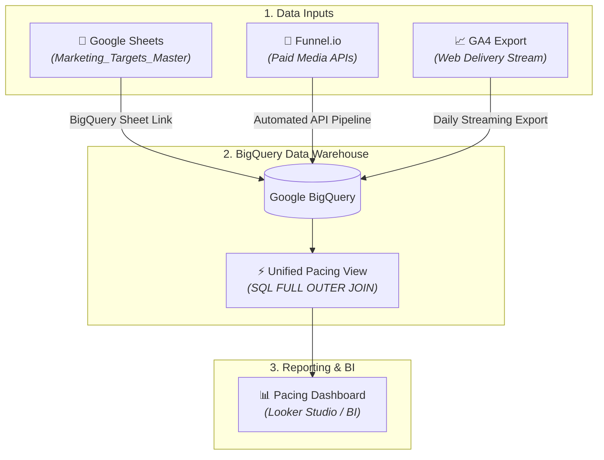

# 🚀 Automated Marketing Pacing & Performance Pipeline

An enterprise-grade data warehouse architecture built on **Google BigQuery** and **Looker Studio**. This system automatically ingests cross-channel ad spend, web analytics delivery, and human-defined targets to deliver real-time budget and conversion run-rate pacing alerts.

---

## 🏗️ Architecture Overview

## 📊 Data Requirements & Schema

The system unifies three distinct data requirements into a single analytical view.

### 1. Paid Media Delivery Schema (e.g., via Funnel.io)
Tracks platform-level performance (Google Ads, Meta, TikTok, etc.) at a daily level.

| Field Name | Type | Description |
| :--- | :--- | :--- |
| `Date` | `DATE` | Event date (`YYYY-MM-DD`) |
| `Channel` | `STRING` | Paid channel identifier (e.g., `Paid Search`, `Paid Social`) |
| `Cost` | `NUMERIC` | Gross spend amount (£) |
| `Impressions` | `INTEGER` | Total ad impressions |
| `Clicks` | `INTEGER` | Total ad clicks |

### 2. Web Analytics Delivery Schema (e.g., via GA4 Export)
Tracks site-level sessions and conversion activity for **all traffic sources** (Paid & Organic).

| Field Name | Type | Description |
| :--- | :--- | :--- |
| `Date` | `DATE` | Event date (`YYYY-MM-DD`) |
| `Channel` | `STRING` | Channel grouping (`Paid Search`, `Paid Social`, `Organic`, `Email`) |
| `Sessions` | `INTEGER` | Total site visits |
| `GA Transactions`| `INTEGER` | Completed conversions/orders |
| `GA Revenue` | `NUMERIC` | Total attributed revenue (£) |

### 3. Targets Schema (Google Sheets Input)
Human-managed target benchmarks maintained in Google Sheets (`Marketing_Targets_Master`).

| Field Name | Type | Description |
| :--- | :--- | :--- |
| `Month` | `DATE` | Target month start date (`YYYY-MM-01`) |
| `Channel` | `STRING` | Marketing channel |
| `Spend Target` | `NUMERIC` | Allocated monthly budget (£) |
| `Conversions Target` | `INTEGER` | Target conversion volume |
| `Target CPA` | `NUMERIC` | Benchmark cost-per-acquisition (£) |
| `Revenue Target` | `NUMERIC` | Target Revenue (£) |
| `Notes` | `STRING` | Strategic context (e.g., `Spring Campaign Push`) |

---

## 📐 Spreadsheet to BigQuery Field & Calculation Mapping

This table maps traditional pacing spreadsheet formulas directly to their BigQuery SQL view equivalents.

| Spreadsheet Field Name | BigQuery Column Name | Data Type | SQL / Logic Equivalent | Business Context |
| :--- | :--- | :--- | :--- | :--- |
| **Days in month** | `days_in_month` | `INT64` | `EXTRACT(DAY FROM LAST_DAY(date))` | Total calendar days in the current target month |
| **Day of month** | `day_of_month` | `INT64` | `EXTRACT(DAY FROM date)` | Current day number (MTD elapsed days) |
| **Remaining days** | `remaining_days` | `INT64` | `days_in_month - day_of_month` | Days left in the month to adjust pacing |
| **% Days in month** | `pct_days_in_month` | `NUMERIC` | `day_of_month / days_in_month` | Expected target completion baseline % |
| **Forecasted / Budget** | `budget` | `NUMERIC` | `COALESCE(t.spend_target, 0)` | Monthly spend target from Google Sheets |
| **Delivered / Spend MTD**| `spend_mtd` | `NUMERIC` | `SUM(cost)` | Actual gross spend delivered Month-To-Date |
| **% Delivered** | `pct_delivered_spend` | `NUMERIC` | `SAFE_DIVIDE(spend_mtd, budget)` | Raw budget consumption percentage |
| **Avg run rate** | `avg_target_run_rate_spend` | `NUMERIC` | `budget / days_in_month` | Daily spend required to hit monthly target exactly |
| **Current run rate** | `current_run_rate_spend` | `NUMERIC` | `spend_mtd / day_of_month` | Actual daily spend velocity MTD |
| **Expected delivery** | `spend_run_rate_expected` | `NUMERIC` | `current_run_rate_spend * days_in_month` | End-of-month projected total spend if current pace continues |
| **Remaining sales / spend**| `remaining_spend` | `NUMERIC` | `budget - spend_mtd` | Remaining budget left to deploy |
| **Difference vs Budget (£)**| `diff_vs_budget_spend_amt` | `NUMERIC` | `spend_run_rate_expected - budget` | Projected £ over/under spend variance at month end |
| **Difference vs Budget (%)**| `diff_vs_budget_spend_pct` | `NUMERIC` | `SAFE_DIVIDE(diff_vs_budget_spend_amt, budget)` | Projected % over/under spend variance at month end |
| **Acqs Target** | `acqs_target` | `INT64` | `COALESCE(t.conversions_target, 0)` | Monthly conversion target from Google Sheets |
| **Acqs MTD** | `acqs_mtd` | `INT64` | `SUM(actual_conversions)` | Actual conversions delivered Month-To-Date |
| **Acqs Expected Delivery**| `acqs_run_rate_expected` | `NUMERIC` | `(acqs_mtd / day_of_month) * days_in_month` | End-of-month projected total conversions |
| **Acqs Diff vs Budget (#)**| `diff_vs_budget_acqs_amt` | `NUMERIC` | `acqs_run_rate_expected - acqs_target` | Projected conversion volume variance at month end |
| **Acqs Diff vs Budget (%)**| `diff_vs_budget_acqs_pct` | `NUMERIC` | `SAFE_DIVIDE(diff_vs_budget_acqs_amt, acqs_target)` | Projected conversion percentage variance at month end |
| **Store Net Revenue** | `total_shopify_revenue` | `NUMERIC` | `SUM(shopify_revenue)` | Top-line financial source of truth (Shopify API) |
| **MER** | `mer` | `NUMERIC` | `SAFE_DIVIDE(total_shopify_revenue, spend_mtd)` | Marketing Efficiency Ratio (Total Sales / Ad Spend) |
| **Blended CAC** | `blended_cac` | `NUMERIC` | `SAFE_DIVIDE(spend_mtd, total_shopify_orders)` | Blended Acquisition Cost (Ad Spend / Store Orders) |

