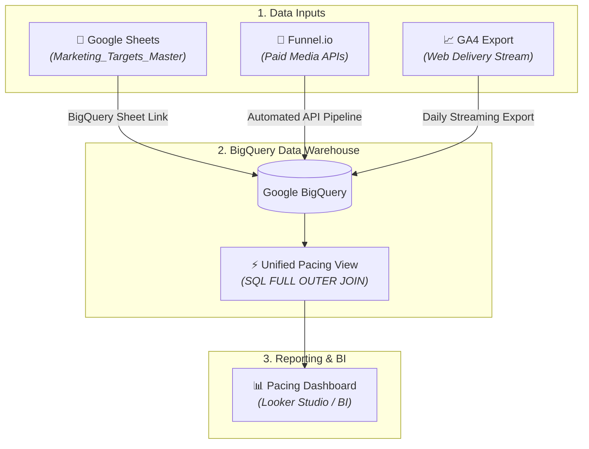

# 🚀 Automated Marketing Pacing & Performance Pipeline

An enterprise-grade data warehouse architecture built on **Google BigQuery** and **Looker Studio**. This system automatically ingests cross-channel ad spend, web analytics delivery, and human-defined targets to deliver real-time budget and conversion run-rate pacing alerts.

---

## 🏗️ Architecture Overview

## 📊 Data Requirements & Schema

The system unifies three distinct data requirements into a single analytical view.

### 1. Paid Media Delivery Schema (e.g., via Funnel.io)
Tracks platform-level performance (Google Ads, Meta, TikTok, etc.) at a daily level.

| Field Name | Type | Description |
| :--- | :--- | :--- |
| `Date` | `DATE` | Event date (`YYYY-MM-DD`) |
| `Channel` | `STRING` | Paid channel identifier (e.g., `Paid Search`, `Paid Social`) |
| `Cost` | `NUMERIC` | Gross spend amount (£) |
| `Impressions` | `INTEGER` | Total ad impressions |
| `Clicks` | `INTEGER` | Total ad clicks |

### 2. Web Analytics Delivery Schema (e.g., via GA4 Export)
Tracks site-level sessions and conversion activity for **all traffic sources** (Paid & Organic).

| Field Name | Type | Description |
| :--- | :--- | :--- |
| `Date` | `DATE` | Event date (`YYYY-MM-DD`) |
| `Channel` | `STRING` | Channel grouping (`Paid Search`, `Paid Social`, `Organic`, `Email`) |
| `Sessions` | `INTEGER` | Total site visits |
| `GA Transactions`| `INTEGER` | Completed conversions/orders |
| `GA Revenue` | `NUMERIC` | Total attributed revenue (£) |

### 3. Targets Schema (Google Sheets Input)
Human-managed target benchmarks maintained in Google Sheets (`Marketing_Targets_Master`).

| Field Name | Type | Description |
| :--- | :--- | :--- |
| `Month` | `DATE` | Target month start date (`YYYY-MM-01`) |
| `Channel` | `STRING` | Marketing channel |
| `Spend Target` | `NUMERIC` | Allocated monthly budget (£) |
| `Conversions Target` | `INTEGER` | Target conversion volume |
| `Target CPA` | `NUMERIC` | Benchmark cost-per-acquisition (£) |
| `Notes` | `STRING` | Strategic context (e.g., `Spring Campaign Push`) |

---

